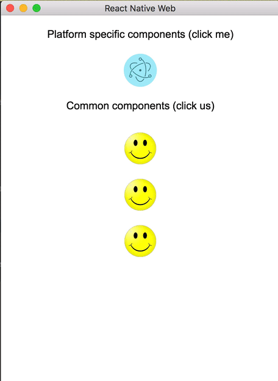
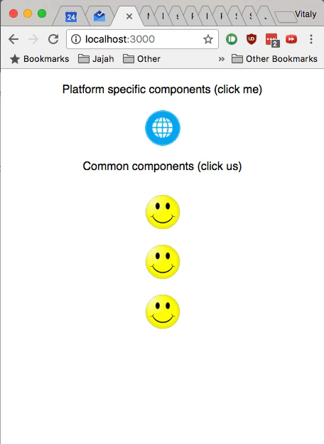

Universal React - Android, Electron (Desktop) and Web
=====================================================

Electron             |  Web |
|:-------------------------:|:-------------------------:|
 | 

Android                       | iOS
|:-------------------------:|:---------:|
 | 

Android                       | iOS
|:-------------------------:|:---------:|
 | 

About
-----

This sample demonstrates the usage of React Native in in the **desktop, web and mobile** environment **using the same code**.

Components or services that should differ between the platforms are easy to to include using a predefined suffix.

What's included
---------------

The following features are included and demonstrated:

* Using shared components (e.g using `Ball.js` in [BallsList.js](app/BallsList.js))
* Using platform specific components (e.g using `PlatformSpecificBall.js` in [BallsList.js](app/BallsList.js))
* Packaging production build for Web and Electron (for Android follow the [official guide](https://facebook.github.io/react-native/docs/signed-apk-android.html))
* React Native's ListView
* React Native's Animations

Running
-------
The following commands are available:

* `yarn run web` - Web development
* `yarn run web-build` - Web production package
* `yarn run desktop` - Electron development
* `yarn run desktop-build` - Electron production package
* `yarn run android` - Android development

Structure
---------

**Platform specific components**

By default all the javascript files are shared by all the platforms. To create a platform specific file, suffix it accordingly.

For example if you have a generic `Ball.js` file and would like Electron to have its own platform specific version, we'd create a new file `Ball.electron.js`.

The file will be imported everywhere without extension: `import Ball from './Ball`. All the platforms will import the generic file and only Electron will import its own platform file.

This mechanism is achieved by Webpack's [extension resolution](https://webpack.js.org/configuration/resolve/#resolve-extensions).

**Web and Electron**

Powered by the [react-native-web](https://github.com/necolas/react-native-web) project.

Webpack configuration (in [webpack/config](webpack/config)) are based on the scripts of [create-react-app](https://github.com/facebookincubator/create-react-app) with only minor changes that allows it to be updated by future changes.

What's missing
--------------

Missing features:

* iOS demonstration (Should be really easy to add, PRs are welcome)
* Test

License
-------

This project is [MIT licensed](LICENSE).
